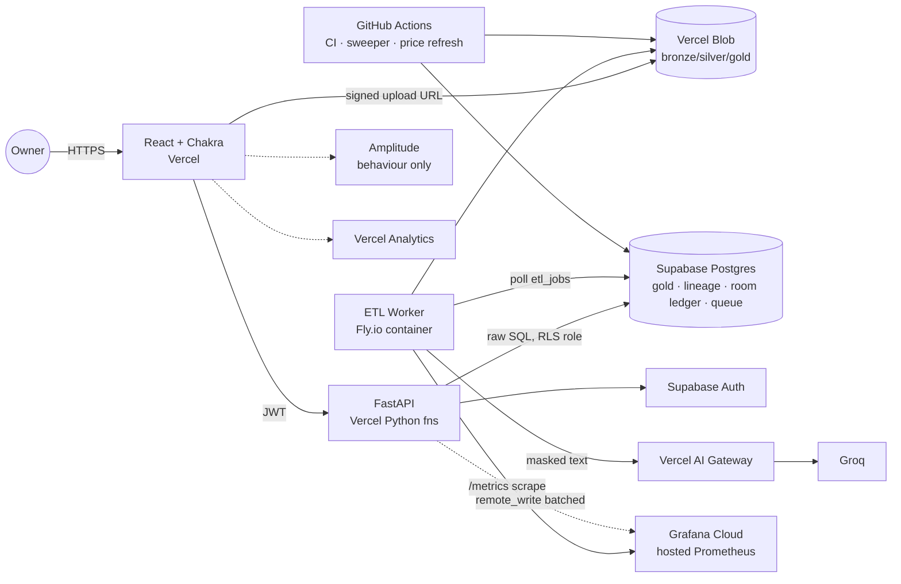
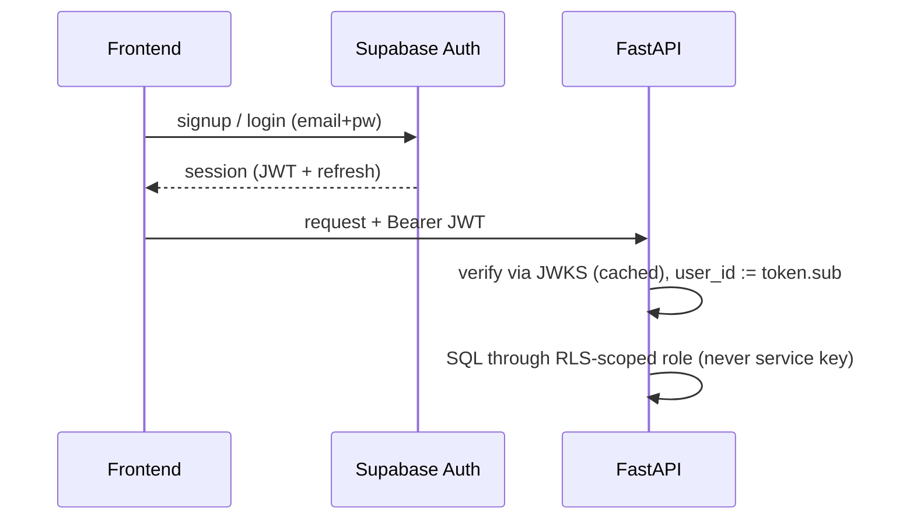

# ADR v1.0.0 — AssetAuditor Architecture (Recommended)

- **Status:** **Superseded by [ADR v1.1.0](ADR_v1.1.0.md)** (2026-08-31) — v1.1.0 replaces the Fly.io worker with the owner's GPU box and Vercel AI Gateway with a self-hosted LiteLLM router; everything else here still stands
- **Date:** 2026-08-31
- **Deciders:** owner (chawlas.k620@gmail.com), planning agent
- **Posture:** best-solution-first. Keeps the owner's stack (React/Chakra, FastAPI, Vercel, Supabase, raw SQL, Vercel Blob, Grafana-hosted Prometheus, Amplitude, Vercel Analytics, AI Gateway→Groq, MDX, GitHub Actions) and makes **one deliberate deviation**: ETL runs on a small always-on worker instead of inside Vercel functions. The strict-stack alternative is [ADR_v2.0.0.md](ADR_v2.0.0.md).

## 1. Context

AssetAuditor audits one user's Canadian finances: statements from 8 institutions are ingested through a masked, lineage-tracked medallion pipeline (bronze→silver→gold) into net-worth / term-bucket / diversification dashboards and TFSA/RRSP/FHSA contribution-room ledgers. Priorities, fixed by the owner: **data provenance > user satisfaction > maintainability > testing > docs > timeline**. Full rationale notes live in the vault: [System-Overview](../vault/30-architecture/System-Overview.md) and siblings.

## 2. Decision summary (one line per component)

| Concern | Decision | Key tradeoff accepted |
|---|---|---|
| Frontend | React + Vite + Chakra UI on Vercel; Recharts for pies/drill-down | Chakra's default look needs theming effort to feel "Linear-grade" |
| API | FastAPI as Vercel Python functions (single ASGI app, `api/index.py`) | cold starts (~1s); mitigated by keeping API thin |
| **ETL compute** | **Dedicated worker container (Fly.io/Railway hobby tier), Postgres-table job queue** | one non-Vercel deploy target; worth it — see §4 |
| DB / Auth | Supabase Postgres + Supabase Auth (JWT verified in FastAPI via JWKS), RLS on all user tables | raw SQL means we own migrations + injection discipline |
| Data layer | Raw SQL: versioned `.sql` migrations, parameterized query modules, CI lint against f-string SQL | more boilerplate than an ORM; explicit and teachable (a project goal) |
| Files | Vercel Blob: `bronze/` (14-day TTL via sweeper), `silver/` parquet, `gold/` CSV exports | Blob has no native lifecycle rules → sweeper job is retention-critical |
| Lineage | OpenLineage-format events in Supabase `lineage_events`; Marquez optional later | no lineage-graph UI day one; drill-down UI covers the user-facing need |
| Metrics | Grafana Cloud **hosted Prometheus**: worker scraped via Alloy, functions push remote_write | per-invocation pushes must be batched; label cardinality discipline |
| Analytics | Amplitude (behaviour events only — no financial values) + Vercel Analytics | conscious loss: no value-based product analytics |
| LLM | Vercel AI Gateway → Groq (JSON-schema outputs, temp 0, masked input only); vLLM self-host is a versioned later swap | third party sees masked statement text; gateway adds spend caps + failover |
| Content | MDX in-repo, rendered by frontend | no CMS UI; git is the CMS |
| CI/CD | GitHub Actions: lint/type/test → deploy (Vercel + worker) + cron jobs (sweeper, price refresh, golden-set LLM evals) | GitHub cron jitter (±minutes) — fine for daily jobs |

## 3. System context



## 4. The one deviation: ETL off Vercel — why

Statement parsing violates every serverless constraint at once: Docling model inference needs CPU+RAM beyond function limits, jobs can exceed max duration, and Prometheus histograms want a long-lived process. Chunking ETL into function-sized steps (ADR v2 shows how) is possible but buys complexity with no user value, and the owner explicitly said *"do not let technical complexity be the reason to choose a sub-par solution"* — the honest reading cuts both ways: the sub-par solution here is contorting ETL into serverless, not adding a $5/month container. The worker is a single Dockerfile, deployed by the same GitHub Actions pipeline, polling the same Postgres. Everything else stays on the listed stack.

## 5. Ingestion flow (upload → gold)

```mermaid
sequenceDiagram
    actor U as Owner
    participant FE as Frontend
    participant API as FastAPI
    participant B as Vercel Blob
    participant DB as Supabase
    participant W as ETL Worker
    participant L as Groq (via AI GW)

    U->>FE: drop Scotiabank PDF
    FE->>API: POST /uploads (institution?, period?)
    API->>DB: INSERT bronze_files(sha256?, status=pending) + etl_jobs
    API-->>FE: signed Blob URL
    FE->>B: PUT file → bronze/{user}/{uuid}.pdf
    W->>DB: claim job (FOR UPDATE SKIP LOCKED)
    W->>B: GET bronze file
    W->>W: pdfplumber extract → adapter match
    alt adapter confident
        W->>DB: staged_rows(method=deterministic, confidence)
    else unknown layout
        W->>W: Docling structure + MASK PII
        W->>L: masked text + JSON schema
        L-->>W: candidate rows + per-field confidence
        W->>DB: staged_rows(method=llm, confidence)
    end
    W->>DB: lineage_events(RUNNING→COMPLETE)
    FE->>U: parse-confirm screen (low-confidence highlighted)
    U->>API: confirm/correct rows
    API->>DB: promote → silver refs; corrections logged
    W->>B: write silver parquet
    W->>DB: rebuild gold (snapshots, buckets, cuts, room ledger)
    W->>B: export gold CSVs
    W->>DB: lineage_events(gold outputs + row counts)
```

## 6. Auth & account lifecycle

```mermaid
stateDiagram-v2
    [*] --> Active: signup + profile
    Active --> Deactivated: "deactivate my data"\n(deactivated_at set)
    Deactivated --> Active: reactivate
    Active --> PendingDeletion: delete account
    Deactivated --> PendingDeletion: delete account
    PendingDeletion --> Purged: purge job — rows, blobs,\nlineage payloads, auth identity (≤30d)
    Purged --> [*]
    note right of Deactivated: data frozen — excluded from ETL,\ndashboards, exports; fully restorable
    note right of Purged: lineage retains content hashes\nonly (no reconstructable data)
```





## 7. Data model (core tables)

`users_profile` (age, holdings_country, year_in_canada, fhsa_opened_year, risk_profile, deactivated_at) · `bronze_files` (sha256, institution, period, blob_url, purged_at) · `etl_jobs` (status, claimed_by, error) · `staged_rows` (jsonb payload, confidence, method, confirmed_at) · `accounts` / `holdings` / `lots` / `transactions` / `liabilities` (silver refs; masked identifiers; pgsodium-encrypted mapping table for real account numbers) · `room_events` (ledger — see [Contribution-Rooms](../vault/20-domain/Contribution-Rooms.md)) · `networth_snapshots`, `term_buckets`, `diversification_cuts` (gold) · `lineage_events` (OpenLineage JSON) · `prices` (ticker, date, source).

Lineage/drill-down chain: pie slice → gold rows → `run_id` → inputs (bronze hash, extraction method, confirmation timestamp). One query path serves provenance and UX ([Provenance-First](../vault/10-mental-models/Provenance-First.md)).

## 8. Security & privacy (summary — details in vault)

TLS everywhere; Supabase at-rest encryption + pgsodium column crypto for high-sensitivity columns; masking before silver and before every LLM call; RLS from migration 0001; parameterized SQL enforced by CI lint; retention sweeper (bronze 14d, logs 4d) with a **staleness alert treated as a privacy incident**; analytics and metrics carry no financial values or identifying labels. Threat table: [Security-Model](../vault/30-architecture/Security-Model.md).

## 9. Consequences

**Positive:** every requirement gets a first-class home; provenance is structural, not bolted on; the two hard operational risks (retention, masking) are single-owner jobs with alerts; blog-worthy architecture with honest tradeoff narrative.
**Negative / accepted:** two deploy targets (Vercel + worker); no lineage-graph UI until Marquez is added; Groq sees masked text (until vLLM swap); Chakra theming work to reach the desired visual bar.
**Rejected alternatives:** all-serverless ETL (ADR v2 — kept as fallback), Marquez day-one (ops burden), ORM (owner chose raw SQL; discipline codified instead), OCR support (deferred, Assumption A3).

## 10. Follow-ups
Versioned successors expected: `ADR_v1.1.x` (vLLM self-host swap), `ADR_v1.2.x` (Marquez lineage UI), `ADR_v1.3.x` (fund look-through for diversification).
