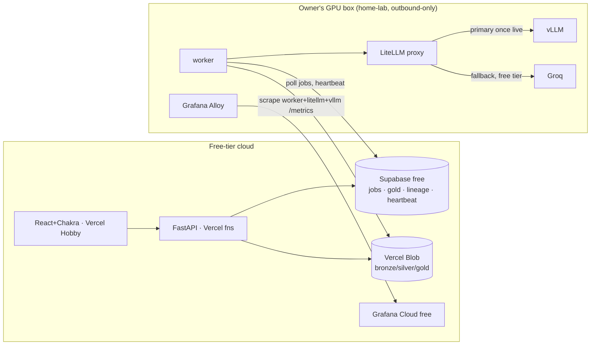
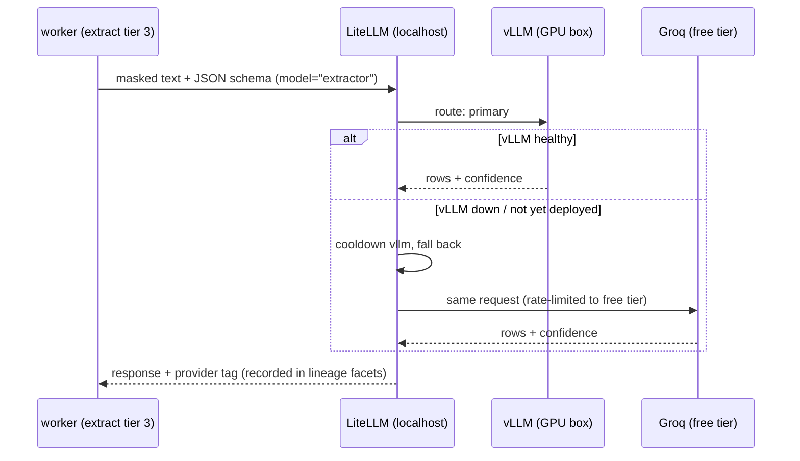

# ADR v1.1.0 — Zero-Cost Home-Lab Compute + LiteLLM Router

- **Status:** Proposed (supersedes [ADR v1.0.0](ADR_v1.0.0.md); delta-style — anything not mentioned here is unchanged from v1.0.0)
- **Date:** 2026-08-31
- **Deciders:** owner + planning agent (CLARIFICATIONS round 1 + follow-up decisions)

## 1. What changed and why

Two owner constraints landed after v1.0.0:
1. **Zero cost until the single-user MVP exists.** "The compute should be free, the single user can wait." This kills the ~$5/month Fly.io worker.
2. **A GPU box with vLLM + an evaluation harness is incoming.** This kills ADR v2.0.0's relevance entirely — its all-serverless design forecloses self-hosted inference — and it makes the owner's hardware the obvious free compute.

Re-research confirmed there is no honest cloud alternative: free always-on compute is effectively extinct in 2026 (Oracle Always Free halved to 2 OCPU/12GB with termination notices; Fly/Heroku/Railway free tiers gone). GitHub Actions on a public repo is genuinely free and unlimited but would process real financial PII on GitHub-hosted runners — rejected as primary on privacy grounds, noted as a salvage path.

## 2. Decision A — ETL worker runs on the owner's GPU box (home-lab)

One `docker-compose.yml` on the GPU box with three services:

| Service | Role | Notes |
|---|---|---|
| `worker` | ETL: extract (pdfplumber/Docling) → mask → stage → silver/gold → lineage | polls Supabase `etl_jobs` **outbound only** — no inbound ports, no dynamic DNS, nothing exposed to the internet |
| `litellm` | LLM router (Decision B) | localhost-only listener |
| `vllm` | self-hosted inference | compose **profile-gated** (`--profile gpu`) so the stack runs Groq-only until the box arrives |

**Availability model (the accepted tradeoff):** jobs queue in Postgres while the box is off. A `worker_heartbeat` table (updated every ~30s while running) lets the UI say *"queued — will process when your worker is online"* instead of appearing broken. Grafana alerts if jobs sit queued while the heartbeat is stale.

**Recovery:** the worker is stateless — bronze/silver live in Blob, state in Supabase. If the box dies, `docker compose up` anywhere resumes the queue. Nothing on the box is the only copy of anything.

## 3. Decision B — LiteLLM proxy replaces Vercel AI Gateway

Self-hosted [LiteLLM](https://docs.litellm.ai/docs/) is the single LLM gateway — exactly the "rate-limiting proxy to choose Groq or vLLM" requirement:

- **One OpenAI-compatible endpoint**; the worker's extraction code never knows which backend served it.
- **Routing/fallback:** model group `extractor` → `vllm` primary (once live) → `groq` fallback; automatic cooldown when a provider errors or hits quota, then re-route. Until the GPU box lands, config lists Groq only — promoting vLLM is a YAML edit, not a code change.
- **Rate limits & budgets:** RPM/TPM caps sized to the Groq free tier so a runaway loop can never generate a bill; per-key virtual keys if anything else ever needs LLM access.
- **Eval harness fit:** golden-set evals point at the same endpoint; Groq↔vLLM comparison is a config/model-name switch, and LiteLLM's spend/usage logs feed the eval reports.
- Config lives in-repo at `llm/litellm.config.yaml`, reviewed like code.

Vercel AI Gateway is dropped: its value was for calls originating on Vercel, and all LLM calls now originate on the worker, colocated with LiteLLM. Masking before every call is unchanged and still mandatory (Groq remains a third party; vLLM keeps masked text on-box, which is the privacy end-state the owner wanted).

The provider that served each extraction is recorded in the lineage event (`extraction_backend: vllm|groq`) — provenance extends into model choice, which the eval harness will also want.

## 4. Cost table (the zero-cost contract)

| Component | Free ceiling | Trip-wire that would ever cost money |
|---|---|---|
| Vercel Hobby (frontend + fns + Blob + Analytics) | Hobby limits (bandwidth/fn-hours/Blob GB) | traffic beyond hobby limits — implausible for 1 user |
| Supabase free | 500MB DB, 1GB storage, pauses after 1wk inactivity | DB >500MB (gold is small; silver parquet lives in Blob, not DB); weekly cron ping prevents pausing |
| Grafana Cloud free | 10k metric series / 50GB logs class limits | label-cardinality mistakes — guarded by the enum-only label rule |
| Groq free tier | RPM/TPM/daily caps | none — LiteLLM hard-caps below the free tier; over-cap requests queue, never upgrade |
| GPU box | owner's electricity | — |
| GitHub Actions | unlimited on public repo | — |

**Rule (new Assumption A16):** any component leaving its free tier is a design event that gets an ADR bump, not a credit-card entry.

## 5. Consequences

**Positive:** $0/month; PII processing moves onto owner hardware (strictly better privacy than Fly); vLLM is now in-line rather than a future swap; the router makes the eval harness a first-class consumer; no inbound network exposure at home.
**Negative / accepted:** ETL availability tied to a home machine being on (mitigated by queue + heartbeat UX); residential upload bandwidth bounds silver-parquet write speed (fine at single-user volume); one more service (LiteLLM) to keep configured — its config is 30 lines of YAML in-repo.
**Rejected:** GitHub Actions as primary ETL (PII on GH runners), Oracle Always Free (shrinking, termination risk), keeping Vercel AI Gateway alongside LiteLLM (two config surfaces, no caller left on Vercel).

## 6. Follow-ups
`ADR_v1.2.x` — Marquez lineage-graph UI. `ADR_v1.3.x` — ETF fund look-through. (The vLLM swap is no longer a follow-up; it is this ADR.)
