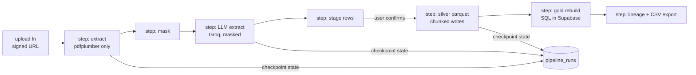

# ADR v2.0.0 — Strict Listed-Stack Variant (everything on Vercel)

- **Status:** **Rejected 2026-08-31 — archived for the record.** The owner's zero-cost constraint plus an incoming GPU box with vLLM make all-serverless doubly wrong: it saves money that no longer needs saving (the home-lab worker is $0) and forecloses the self-hosted-inference future that is now confirmed. Kept because the chunked-ETL patterns in §1 are salvageable if a serverless-only constraint ever returns. Current architecture: [ADR v1.1.0](ADR_v1.1.0.md).
- **Date:** 2026-08-31
- **Posture:** zero deviations from the listed stack: no compute outside Vercel + Supabase + GitHub Actions. This ADR exists so the choice against it is honest and reviewable. Only deltas from v1 are described; everything not mentioned is identical.

## 1. Delta: ETL inside Vercel functions

ETL becomes a chain of function-sized steps, orchestrated by a `pipeline_runs` state machine in Postgres, each step re-triggered by the frontend polling or Vercel cron:

**Costs accepted in this variant:**
1. **No Docling tier.** VLM inference cannot fit function limits → unknown PDF layouts go straight to Groq with weaker table structure, or to manual entry. Extraction quality on messy statements drops.
2. **Chunked parquet writes** (memory ceilings) → more code, more failure states, every step idempotent + checkpointed.
3. **Duration ceilings** — a large statement must finish each step within the plan's function timeout; oversized files are rejected with a "split your statement" message. Real UX cost.
4. **Cold-start latency** on every step transition; a full ingest takes noticeably longer wall-clock.
5. **Queue semantics** rebuilt on polling + cron rather than a blocking worker loop.

## 2. Delta: observability

No long-lived process → no scrape target at all. All metrics are **pushed**: batched remote_write to Grafana Cloud hosted Prometheus from within function execution (flush before return), accepting: possible loss on crashed invocations, no accurate in-flight gauges, histogram aggregation done service-side. Alerting shifts toward log-based checks and `pipeline_runs` table watchdogs (a Vercel cron function marks stalled runs).

## 3. Delta: LLM

Groq-only for MVP is unchanged, but the **vLLM upgrade path dies** in this variant — vLLM cannot run on Vercel, so adopting it later would reintroduce exactly the external compute this ADR exists to avoid. If prompt privacy beyond masking ever becomes a requirement, this variant has no answer.

## 4. What stays identical
Frontend, Supabase schema/RLS/raw-SQL discipline, masking rules, retention policy + sweeper (GitHub Actions), lineage-events table, Amplitude/Vercel Analytics posture, MDX, CI/CD.

## 5. Verdict

Choose this only if "single deploy target" outweighs extraction quality, ingest latency, and the vLLM path. Priced against the alternative: ADR v1's worker costs ~$5/month and one extra deploy job. Given the owner's priority order (provenance and user satisfaction above delivery convenience) and the explicit instruction not to let technical complexity force a sub-par solution, **v1 is recommended**; v2 remains viable as a degraded-mode fallback if the worker host ever becomes unacceptable.
